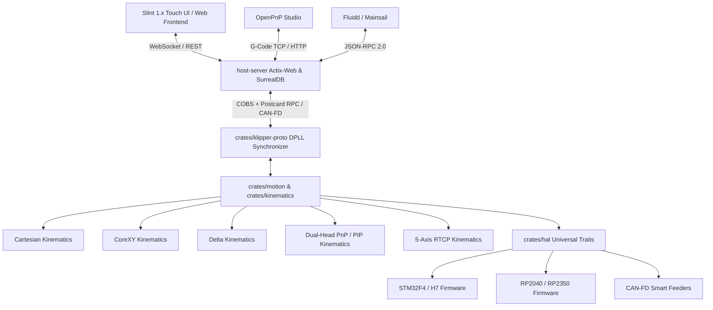

# `r_klipp`: Universal High-Performance Motion Control & Machine Operating System in Rust

[](https://www.rust-lang.org)
[](LICENSE)
[]()
[]()
[](https://slint.dev)

> [!IMPORTANT]
> **r_klipp** is a modular, hardware-agnostic, memory-safe machine control platform written entirely in Rust. It provides a drop-in, real-time control system for **High-Speed 3D Printers**, **SMT Pick & Place (PnP / PIP) Machines**, and **3–5 Axis CNC Milling Centers**.

---

## 🌟 Architectural Highlights



### 1. Multi-Target Machine Engine
- 🖨️ **Additive Manufacturing (3D Printing)**:
  - High-order S-Curve ($G^4$ 31-phase) and Pythagorean-Hodograph (PH) corner blending.
  - State-space Model Predictive Control (MPC) and Kalman-filtered thermal regulation.
  - Dynamic Pressure Advance extrusion modeling ($k \cdot v$) and volumetric compensation.
- 🎯 **Electronics Manufacturing (Pick & Place / PIP)**:
  - Dual-head kinematics with independent Z1/Z2 vertical and C1/C2 rotary axis control.
  - Position-synchronized discrete hardware I/O for sub-millisecond bottom-camera exposure triggering.
  - CAN-FD Smart Feeder RPC protocol and TMC2240 StallGuard syringe paste dispensing protection.
  - Direct integration bridge with [OpenPnP](https://openpnp.org).
- ⚙️ **Subtractive Manufacturing (3–5 Axis CNC)**:
  - 5-Axis Rotary Tool Center Point (RTCP) kinematics for table-table AC trunnions.
  - Closed-loop VFD spindle regulation with Constant Surface Speed (CSS / G96).
  - Dynamic G43/G44 tool length/radius compensation and tool-wear table management.
  - Single-tick G38.2 contact probing supervisor and enclosure door safety interlocks.

### 2. Zero-Jitter Real-Time Core
- **`no_std` Pure Math Core**: The motion planner, kinematics engine, parser, and safety supervisors compile without standard library dependencies, running directly on bare-metal ARM Cortex-M and RISC-V targets.
- **Distributed Phase-Locked Loop (DPLL)**: Sub-microsecond clock synchronization across multiple microcontrollers over USB and CAN-FD.
- **Hardware-Enforced Safety**: Microsecond IWDG watchdogs, thermal runaway boundaries, and emergency stop interlocks.

---

## 📂 Workspace Crates Overview

| Crate | Path | Description |
| :--- | :--- | :--- |
| **`r_klipp_hal`** | [`crates/hal`](crates/hal/) | Universal hardware traits (`StepperAxis`, `DigitalOutput`, `PwmOutput`, `CommunicationBus`). |
| **`motion`** | [`crates/motion`](crates/motion/) | $G^4$ 31-phase jerk-limited trajectory generator, corner blending, spindle CSS, and sync I/O. |
| **`kinematics`** | [`crates/kinematics`](crates/kinematics/) | Cartesian, CoreXY, Delta, Dual-Head PnP, and 5-Axis RTCP kinematics transformations. |
| **`parser`** | [`crates/parser`](crates/parser/) | Zero-allocation streaming G-Code lexer and AST parser. |
| **`safety`** | [`crates/safety`](crates/safety/) | Watchdog monitors, touch probe supervisors, and machine door enclosure interlocks. |
| **`thermal`** | [`crates/thermal`](crates/thermal/) | PID + Kalman-filtered MPC hotend/bed temperature controller and runaway guards. |
| **`klipper-proto`** | [`crates/klipper-proto`](crates/klipper-proto/) | High-speed binary framing, COBS encoding, Postcard serialization, and CAN feeder RPC. |
| **`compat-layer`** | [`crates/compat-layer`](crates/compat-layer/) | Configuration parser and multi-machine profile validator (`3d_printer`, `pnp`, `cnc`). |
| **`sim`** | [`crates/sim`](crates/sim/) | Deterministic hardware-in-the-loop and software simulator with SVG/CSV trajectory visualizers. |
| **`host-server`** | [`host-server`](host-server/) | Multi-threaded Moonraker/OpenPnP REST & WebSocket server backed by SurrealDB. |
| **`host-ui`** | [`host-ui`](host-ui/) | Slint 1.x touch screen operator console for local panel displays. |

---

## 🛠️ Quickstart

### Prerequisites
- **Rust Toolchain**: 1.75+ (Edition 2021)
- **Target Setup (for Embedded Targets)**:
  ```bash
  rustup target add thumbv7em-none-eabihf
  cargo install probe-rs-tools
  ```

### 1. Running Unit & Integration Tests
```bash
# Run full suite across all workspace crates
cargo test -p parser -p motion -p kinematics -p thermal -p safety -p sim -p klipper-proto -p compat-layer -p r_klipp_api -p host-ui -p host-server
```

### 2. Running the Trajectory Simulator
```bash
# Run simulation pipeline and export toolpath SVG & CSV
cargo test -p sim test_gcode_pipeline_with_export -- --nocapture
```
Outputs are generated in `target/sim_trajectory.csv` and `target/sim_toolpath.svg`.

### 3. Launching the Host Server & UI
```bash
cargo run -p host-server
```

---

## 📖 Documentation Index

- 📘 [Developer Guide](DEVELOPER_GUIDE.md): Architecture breakdown, build recipes, and flashing guides.
- 📐 [Architecture Deep Dive](docs/architecture.md): Complete system concurrency, DPLL math, and state machine diagrams.
- 🛡️ [Safety & Interlock Protocols](docs/safety.md): Watchdog supervisors, probe latches, and runaway detection.
- 📡 [Wire Protocol Specification](docs/protocol.md): Packet structures, COBS framing, and DPLL timestamping.
- 🤝 [Contributing Guidelines](CONTRIBUTING.md): Code conventions, testing requirements, and PR workflows.

---

## 📄 License

Licensed under either of [Apache License, Version 2.0](LICENSE-APACHE) or [MIT License](LICENSE-MIT) at your option.
