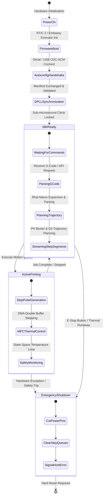
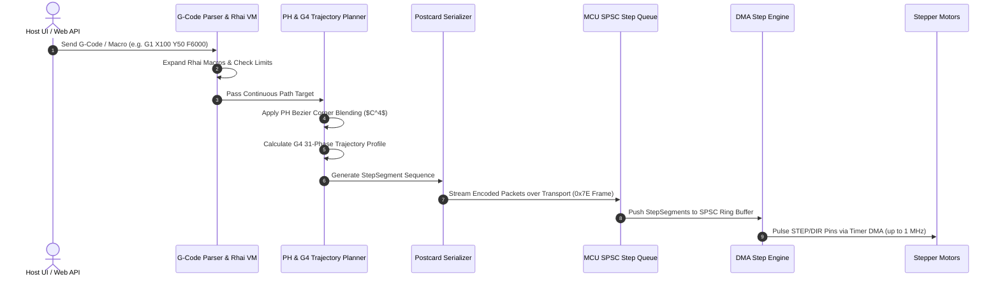
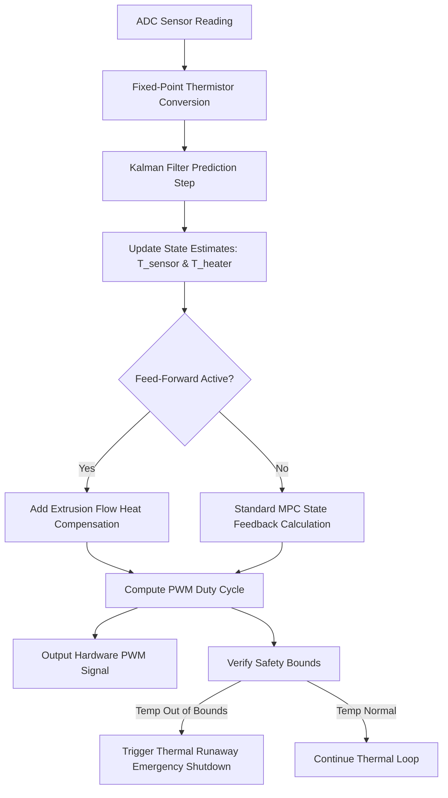

# r_klipp System Application Flow & Operations

This document details the end-to-end operational workflows, system state transitions, command execution pipelines, user interface flows, and error recovery sequences in **r_klipp**.

---

## 1. System High-Level Lifecycle Flow

---

## 2. Startup & Handshake Protocol Flow

1. **Firmware Initialization**:
   - MCU powers on; RTIC 2 priority interrupt hardware and Embassy async executor initialize.
   - Peripherals (GPIO, Timers, DMA, ADCs) are configured into a known safe state (all heaters disabled).
2. **Self-Describing Autoconfig Manifest Transmission**:
   - The MCU constructs a `HandshakeManifest` listing all board pins, clock speeds, and capability vectors (`PinCapability`).
   - The manifest is serialized using the `postcard` binary protocol and sent over USB/UART with sync header (`0x7E`).
3. **Host Validation & Protocol Lock**:
   - `klipper-host` deserializes `HandshakeManifest` without dynamic allocation.
   - The host verifies hardware parameters against the printer configuration file within **1.5 seconds**.
4. **DPLL Clock Synchronization Initialization**:
   - Host sends continuous time-sync ping packets.
   - MCU captures local hardware timer ticks and returns timestamps.
   - Host computes recursive least squares linear regression ($y = mx + c$) to establish clock alignment across single or multi-MCU setups.

---

## 3. G-Code Processing & Motion Execution Pipeline Flow

---

## 4. State-Space MPC Thermal Control Flow

---

## 5. Homing & Calibration Workflow

1. **Braking Curve Safe Homing**:
   - Host issues homing command for axis ($X$, $Y$, or $Z$).
   - Motion planner calculates velocity profile bound by an **85% safety factor braking distance**.
   - Stepper engine moves axis towards endstop/sensor at specified homing speed.
2. **Endstop Trigger & Preemptive Lock**:
   - Hardware interrupt triggers instantly when endstop changes state.
   - DMA step generation for the homing axis is halted in hardware ($< 1 \mu s$).
   - Current motor position is recorded into hardware registers and returned to host.
3. **Axis Backoff & Precision Re-probe**:
   - Axis backs off by pre-configured distance and re-approaches at low velocity for sub-micron zero positioning.

---

## 6. Emergency Stop & Fault Recovery Sequence

When a critical fault occurs (e.g., thermal runaway, loss of DPLL sync, watchdog timeout, physical E-Stop):

1. **MCU Hard-Stop Interrupt**:
   - RTIC highest-priority interrupt cuts power to all heater PWM pins immediately.
   - Stepper EN (Enable) pins are pulled HIGH/LOW to disable motor torque.
2. **Buffer Flush & Host Notification**:
   - MCU flushes SPSC step queues and cancels active DMA buffers.
   - MCU emits `Shutdown` packet (`0x7E` header) with precise error code (e.g., `ERR_THERMAL_RUNAWAY`, `ERR_WATCHDOG_TIMEOUT`).
3. **Host State Lockdown**:
   - `klipper-host` transitions to `EmergencyShutdown` state.
   - All client UIs display emergency alert modal with fault diagnostic trace.
   - System requires manual user clearing (`M112` acknowledge & host restart) before power can be restored to actuators.
