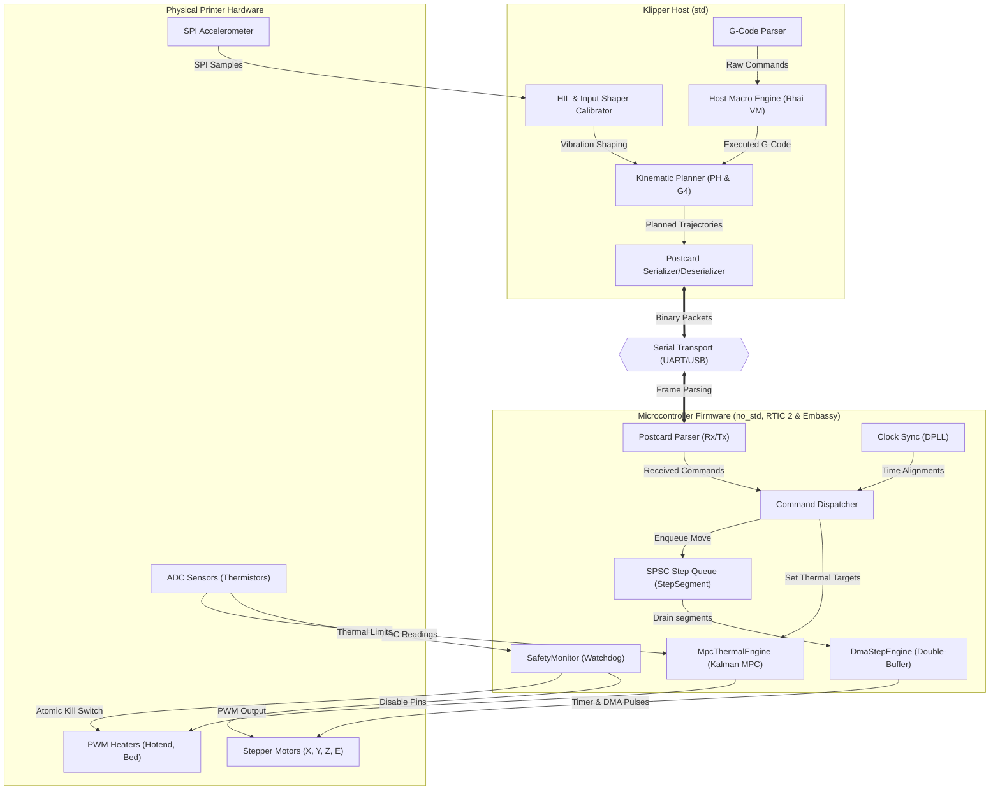
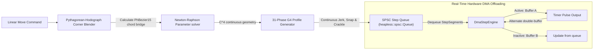
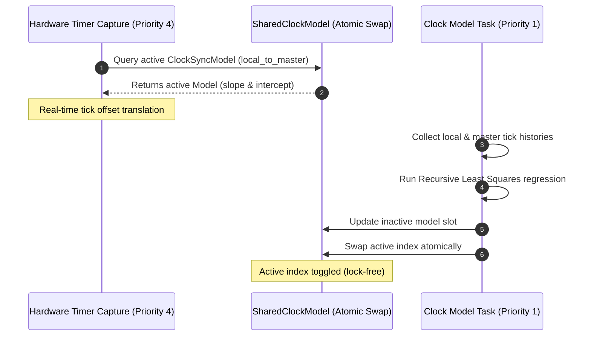

# System Architecture Diagrams

This document contains Mermaid diagrams illustrating the structure, data flows, execution pipelines, and concurrency models of the `r_klipp` system.

---

## 1. System Topology & Data Flow

This diagram shows the complete path from high-level G-Code command execution down to bare-metal motor stepping and thermal feedback loops.



---

## 2. Advanced Motion Control Pipeline

This diagram tracks how movements are solved using continuous blending, Jerk/Snap/Crackle-bounded kinematic profiling, and hardware-assisted stepping.



---

## 3. Dual-Paradigm Concurrency Model

This timeline chart illustrates the scheduling priorities of async (Embassy) and hardware real-time interrupt (RTIC 2) execution.

```mermaid
gantt
    title Task & Interrupt Scheduling Priority Matrix
    dateFormat  X
    axisFormat %s
    
    section Hardware ISRs (RTIC 2)
    Stepper Timer ISR (Priority 5)     :crit, active, 0, 1
    Clock Sync Capture (Priority 4)    :active, 1, 2
    
    section Async Tasks (Embassy)
    Serial Rx/Tx Processing (Priority 3): 2, 5
    Thermal MPC updates (Priority 2)   : 5, 7
    Clock Sync Fitting (Priority 1)    : 7, 9
    Safety Supervision (Priority 1)    : 9, 10
```



---

## 4. State-Space MPC Thermal Regulation

This diagram details the Kalman Filter prediction/correction loops and feedforward mechanism inside the thermal subsystem.

```mermaid
flowchart TD
    %% Estimation Loop
    subgraph Estimator ["Kalman Filter State Estimator"]
        Predict["State Prediction: x_pred(k+1) = A*x(k) + B*u(k) + G*d(k)"]
        Update["Error Correction: x(k+1) = x_pred + K * (y_measured - y_pred)"]
    end

    %% Input Values
    T_ambient["Ambient Temp (T_ambient)"] --> Predict
    Volumetric_Flow["Volumetric Flow Rate"] --> Predict
    Prev_PWM["Previous PWM Output (u_prev)"] --> Predict
    Sensor_Read["ADC Sensor Measurement (y_measured)"] --> Update
    
    Predict -->|Predicted Sensor Temp| Update
    
    %% Controller Loop
    subgraph Controller ["MPC Power Controller"]
        Error["Calculate Internal Core Error: target_temp - T_heater_est"]
        FF["Feed-Forward: scale heater current for extrusion flow rate"]
        Clamp["Clamp PWM Output (0.0 to 1.0)"]
    end
    
    Update -->|Estimated Heater Temp (T_heater_est)| Error
    Update -->|Estimated Sensor Temp (T_sensor_est)| FF
    Volumetric_Flow --> FF
    
    Error --> Clamp
    FF --> Clamp
    Clamp -->|Output PWM Command| Heater["Physical Heater"]
    Clamp -->|Update History| Prev_PWM
```

---

## 5. Multi-MCU Clock Synchronization

This diagram details how the distributed Phase-Locked Loop (DPLL) calculates and updates master synchronization matrices in a lock-free manner.


