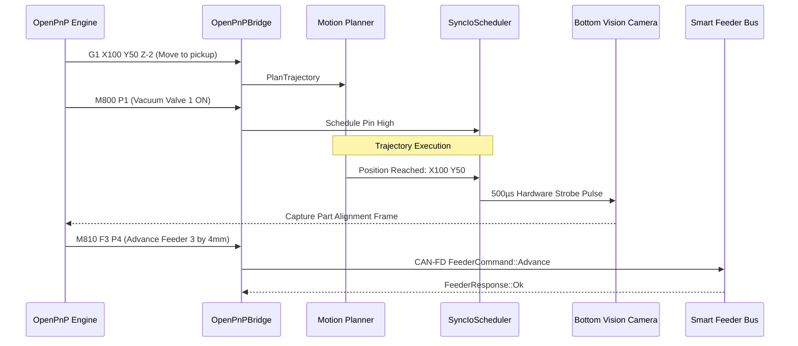
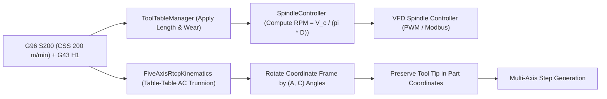
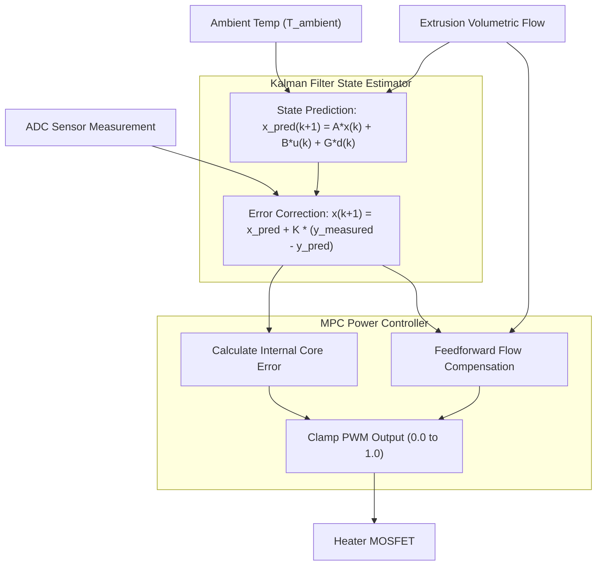

# System Architecture Diagrams & Execution Models

This document provides visual architectural workflows, data flows, execution pipelines, and concurrency models across the `r_klipp` ecosystem.

---

## 1. Universal Multi-Target System Architecture

```mermaid
graph TD
    subgraph Host Application Layer
        UI[Slint 1.x Touch Interface]
        OpenPnPClient[OpenPnP Studio]
        MoonrakerWeb[Fluidd / Mainsail]
    end

    subgraph Host Server (Actix-Web & Tokio Runtime)
        RestWS[REST & WebSocket Engine]
        OpenPnPBridge[OpenPnP G-Code Bridge]
        DB[(SurrealDB Time-Series & Config)]
        SerialBridge[Serial & CAN-FD Driver]
    end

    subgraph Motion & Kinematics Engine (no_std Core)
        Planner[G4 31-Phase Trajectory Generator & PH Blending]
        
        KinematicsSelector{Kinematics Engine}
        KinematicsSelector -->|3D Printer| CoreXY[CoreXY / Cartesian / Delta]
        KinematicsSelector -->|Pick & Place| DualPnP[Dual-Head PnP Kinematics]
        KinematicsSelector -->|5-Axis CNC| RTCP[5-Axis Table-Table RTCP]
        
        Extruder[Pressure Advance & Flow Compensation]
        SyncIO[Microsecond Discrete I/O Scheduler]
        Spindle[Spindle VFD & CSS G96 Controller]
    end

    subgraph Distributed MCU Firmware (STM32 / RP2040)
        DPLL[DPLL Sub-Microsecond Clock Sync]
        StepQueue[Lock-Free SPSC Step Queue]
        DmaStepper[DMA Stepping Engine]
        SafetySupervisor[IWDG & Probe Interlock Supervisor]
    end

    UI <-->|WebSocket| RestWS
    OpenPnPClient <-->|TCP Socket| OpenPnPBridge
    MoonrakerWeb <-->|JSON-RPC| RestWS
    RestWS <--> DB
    RestWS <--> SerialBridge
    OpenPnPBridge <--> SerialBridge
    
    SerialBridge <==>|COBS + Postcard| DPLL
    DPLL --> Planner
    Planner --> KinematicsSelector
    Planner --> Extruder
    Planner --> SyncIO
    Planner --> Spindle
    Planner --> StepQueue
    StepQueue --> DmaStepper
    SafetySupervisor --> DmaStepper
```

---

## 2. Pick & Place (PnP / PIP) Trajectory & Camera Synchronization

```mermaid
sequenceDiagram
    participant PnP as OpenPnP Engine
    participant Bridge as OpenPnPBridge
    participant Planner as Motion Planner
    participant SyncIO as SyncIoScheduler
    participant Camera as Bottom Vision Camera
    participant Feeder as Smart Feeder Bus

    PnP->>Bridge: G1 X100 Y50 Z-2 (Move to pickup)
    Bridge->>Planner: PlanTrajectory
    PnP->>Bridge: M800 P1 (Vacuum Valve 1 ON)
    Bridge->>SyncIO: Schedule Pin High
    
    Note over Planner,SyncIO: Trajectory Execution
    Planner->>SyncIO: Position Reached: X100 Y50
    SyncIO->>Camera: 500µs Hardware Strobe Pulse
    Camera-->>PnP: Capture Part Alignment Frame
    
    PnP->>Bridge: M810 F3 P4 (Advance Feeder 3 by 4mm)
    Bridge->>Feeder: CAN-FD FeederCommand::Advance
    Feeder-->>Bridge: FeederResponse::Ok
```

---

## 3. 5-Axis CNC RTCP & Spindle Constant Surface Speed (CSS)

```mermaid
flowchart LR
    GCode["G96 S200 (CSS 200 m/min) + G43 H1"] --> ToolManager["ToolTableManager (Apply Length & Wear)"]
    ToolManager --> SpindleCtrl["SpindleController (Compute RPM = V_c / (pi * D))"]
    SpindleCtrl --> VFD["VFD Spindle Controller (PWM / Modbus)"]
    
    GCode --> RTCP["FiveAxisRtcpKinematics (Table-Table AC Trunnion)"]
    RTCP --> Trans["Rotate Coordinate Frame by (A, C) Angles"]
    Trans --> Offset["Preserve Tool Tip in Part Coordinates"]
    Offset --> StepEngine["Multi-Axis Step Generation"]
```

---

## 4. State-Space MPC Thermal Regulation Pipeline

```mermaid
flowchart TD
    subgraph Estimator ["Kalman Filter State Estimator"]
        Predict["State Prediction: x_pred(k+1) = A*x(k) + B*u(k) + G*d(k)"]
        Update["Error Correction: x(k+1) = x_pred + K * (y_measured - y_pred)"]
    end

    T_ambient["Ambient Temp (T_ambient)"] --> Predict
    Volumetric_Flow["Extrusion Volumetric Flow"] --> Predict
    Sensor_Read["ADC Sensor Measurement"] --> Update
    Predict --> Update
    
    subgraph Controller ["MPC Power Controller"]
        Error["Calculate Internal Core Error"]
        FF["Feedforward Flow Compensation"]
        Clamp["Clamp PWM Output (0.0 to 1.0)"]
    end
    
    Update --> Error
    Update --> FF
    Volumetric_Flow --> FF
    Error --> Clamp
    FF --> Clamp
    Clamp --> HeaterMOSFET["Heater MOSFET"]
```
