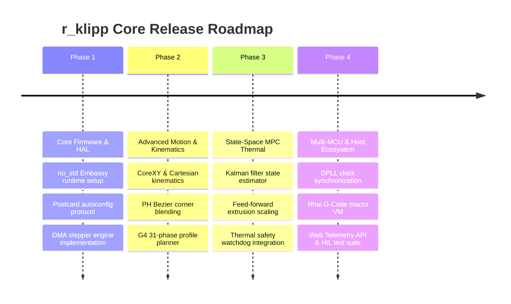

# r_klipp Product Requirements Document (PRD)

This document specifies the product requirements, functional & non-functional specifications, target hardware platforms, release milestones, and validation criteria for **r_klipp**.

---

## 1. Product Overview & Goals

**r_klipp** is an advanced, memory-safe, real-time 3D printer and CNC motion control system written in Rust. It aims to replace traditional C/Python firmware stacks with a high-performance, `no_std` embedded core and a high-reliability host orchestration service.

### Strategic Objectives
1. Eliminate firmware memory safety vulnerabilities and runtime panics.
2. Maximize motion speed and toolpath smoothness via high-order trajectory planning.
3. Provide precise thermal control under variable printing conditions.
4. Simplify printer setup through plug-and-play self-describing hardware configuration.

---

## 2. Functional Requirements

### 2.1. Motion & Kinematics Requirements
- **FR-MOT-01**: Support Cartesian, CoreXY, Delta, and SCARA printer kinematics.
- **FR-MOT-02**: Implement 15th-degree Pythagorean-Hodograph (PH) Bezier curve corner blending maintaining continuous $C^4$ jerk/snap transitions.
- **FR-MOT-03**: Implement a G4 31-phase trajectory generator to minimize machine frame vibration.
- **FR-MOT-04**: Execute stepper pulse generation using double-buffered DMA hardware offloading, sustaining up to 1 MHz step rates per axis.
- **FR-MOT-05**: Provide braking-curve homing protection with a minimum 85% physical safety factor margin.

### 2.2. Thermal Control Requirements
- **FR-THM-01**: Control nozzle, bed, and enclosure heaters using state-space Model Predictive Control (MPC) with Kalman filtering.
- **FR-THM-02**: Support feed-forward extrusion power scaling based on volumetric flow rate.
- **FR-THM-03**: Detect thermal runaway, sensor decoupling, and heater short-circuits within 2.0 seconds of anomaly occurrence.

### 2.3. Host & Scripting Requirements
- **FR-HST-01**: Parse standard NIST RS274/NGC G-Code files and streaming commands over serial, TCP, or Unix domain sockets.
- **FR-HST-02**: Execute user-defined G-Code macros embedded within a sandboxed Rhai scripting VM (`HostMacroEngine`).
- **FR-HST-03**: Enforce a maximum step count execution limit (100,000 operations) per Rhai macro evaluation to prevent host thread starvation.

### 2.4. Protocol & Configuration Requirements
- **FR-PRT-01**: Implement the self-describing `HandshakeManifest` autoconfig protocol over serial/USB transport.
- **FR-PRT-02**: Complete hardware manifestation discovery within 1.5 seconds of enumeration.
- **FR-PRT-03**: Execute binary IPC serialization using zero-copy `postcard` codecs without MCU dynamic memory allocation.

---

## 3. Non-Functional Requirements (NFRs)

### 3.1. Performance & Real-Time Constraints
- **NFR-PERF-01**: MCU step pulse timing jitter shall not exceed 100 nanoseconds under full system load.
- **NFR-PERF-02**: Multi-MCU clock synchronization skew shall be maintained below 100 nanoseconds using DPLL linear regression.
- **NFR-PERF-03**: State-space MPC thermal loop latency shall remain under 100 milliseconds per tick.

### 3.2. Memory & Resource Constraints
- **NFR-MEM-01**: Firmware code shall run entirely under `no_std` without heap allocation (`alloc`).
- **NFR-MEM-02**: Static RAM usage on target MCUs shall remain under 64 KB, permitting deployment on low-cost ARM Cortex-M microcontrollers.
- **NFR-MEM-03**: Flash storage footprint shall remain under 256 KB.

### 3.3. Reliability & Safety Constraints
- **NFR-SAF-01**: All arithmetic operations in target MCU firmware must use saturating fixed-point math (`Fixed16_16`) to prevent overflow panics.
- **NFR-SAF-02**: In the event of communication loss, the MCU hardware watchdog must force all heater pins to LOW state within 500 milliseconds.

---

## 4. Target Hardware Platforms

| Platform Class | Microcontroller / Target OS | Minimum Specs |
| :--- | :--- | :--- |
| **Primary MCU Targets** | STM32F4 / STM32H7 / RP2040 / i.MX RT1060 | 72 MHz ARM Cortex-M4/M7, 64KB RAM, 256KB Flash |
| **Secondary MCU Targets** | STM32F103 / ESP32-S3 | 72 MHz, 48KB RAM, 128KB Flash |
| **Host System** | Raspberry Pi 4 / 5, x86_64 Linux | 1 GHz Dual-Core CPU, 1GB RAM, Debian/Ubuntu |

---

## 5. Release Milestones & Roadmap

---

## 6. Acceptance Criteria & Validation Metrics

1. **Bare-Metal Safety Audit**: 100% clean compilation under `#![no_std]` without `alloc` dependency in `r_klipp_firmware`.
2. **Step Rate Verification**: Logic analyzer verification of steady 1 MHz step pulse frequency without dropped steps over a 1-hour continuous motion test.
3. **Thermal Stability Verification**: Nozzle temperature variation $< \pm 0.1^\circ\text{C}$ over a 30-minute test print at $250^\circ\text{C}$ target with active extrusion.
4. **Safety Intercept Test**: Disconnecting serial communication during motion results in all heaters disabling within $< 500\text{ ms}$.
