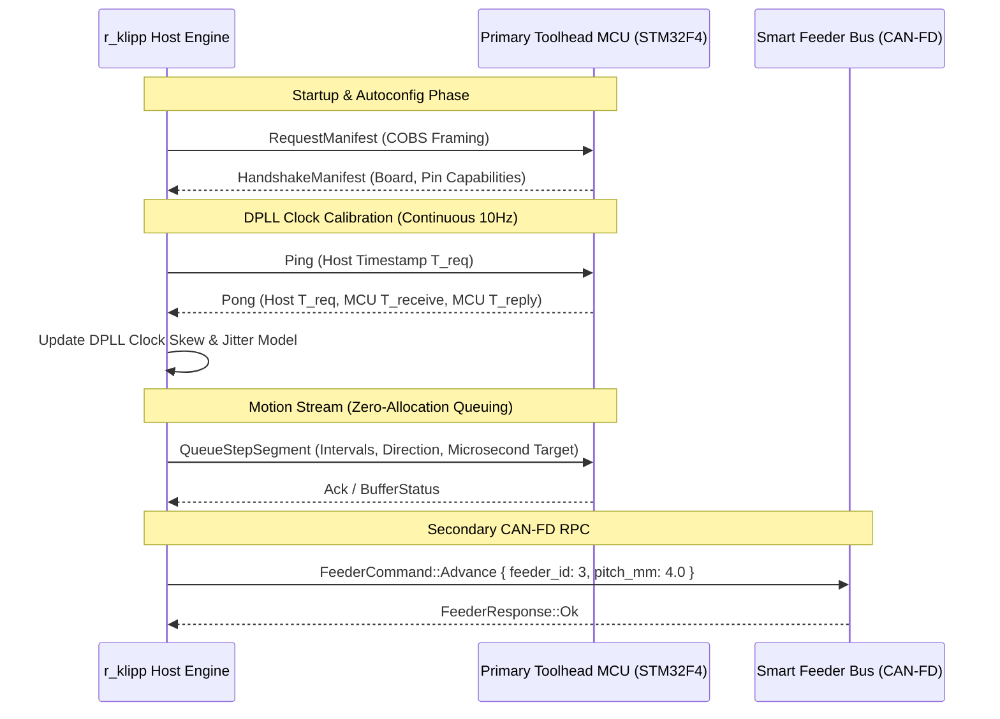

# `r_klipp` Binary Wire & Inter-MCU Protocol Specification

This document specifies the communication protocol connecting the `r_klipp` host server, the real-time MCU firmwares, and peripheral devices (such as CAN-FD smart feeders and toolhead controllers).

---

## 🛰️ 1. Protocol Architecture & Framing



### 1.1 Framing Layer: Consistent Overhead Byte Stuffing (COBS)
- All frames over byte-stream serial transports (USB CDC-ACM, UART RS422/RS485) use **COBS (Consistent Overhead Byte Stuffing)**.
- Packet delimiter is the standard `0x00` zero byte.
- Zero-byte stuffing guarantees unambiguous packet boundary detection with negligible byte overhead ($1\text{ byte per }254\text{ bytes}$).

### 1.2 Data Integrity: CRC-16 CCITT
- Each packet payload terminates with a 16-bit CRC calculated with polynomial $0x1021$ (initial value $0xFFFF$).
- Corrupted packets are rejected before deserialization without causing parser panics.

### 1.3 Serialization: Postcard Binary Codec
- Payloads are serialized using [`postcard`](https://crates.io/crates/postcard), an efficient `serde`-compatible binary format designed specifically for `no_std` embedded systems.

---

## ⏱️ 2. Multi-MCU Clock Synchronization (DPLL)

In multi-board configurations (e.g. mainboard + toolhead CAN board), hardware timers drift due to quartz oscillator thermal variances.

The `DpllClockSynchronizer` in [`crates/klipper-proto/src/clock_sync.rs`](../crates/klipper-proto/src/clock_sync.rs) implements a second-order digital phase-locked loop:

$$\text{MCU\_Clock}(t) = \text{Host\_Clock}(t) \cdot \alpha + \text{Phase\_Offset}$$

- **Sampling Rate**: Periodic roundtrip pings sent at $10\text{ Hz}$.
- **Outlier Filtering**: Packets with roundtrip latency $\Delta t_{\text{RTT}} > 2 \cdot \overline{\Delta t_{\text{RTT}}}$ are discarded.
- **Accuracy**: Sub-microsecond step pulse scheduling across distinct physical microcontrollers.

---

## 📋 3. Self-Describing Autoconfig Manifest

During startup, the MCU compiles a hardware manifest describing its pin capabilities:

```rust
pub struct HandshakeManifest {
    pub board_name: [u8; 32],
    pub clock_speed_hz: u32,
    pub step_resolution_ticks: u32,
    pub pins: heapless::Vec<PinDescriptor, 64>,
}

pub struct PinDescriptor {
    pub pin_index: u16,
    pub name: [u8; 8],
    pub capabilities_mask: u16,
    pub capabilities: heapless::Vec<PinCapability, 4>,
}
```

Capabilities include:
- `DigitalInput` / `DigitalOutput`
- `AnalogInput { resolution_bits: u8 }`
- `PwmOutput { max_freq_hz: u32 }`
- `StepTimerChannel { timer_id: u8 }`

---

## 📦 4. Pick & Place CAN-FD Feeder Protocol

Located in [`crates/klipper-proto/src/feeder.rs`](../crates/klipper-proto/src/feeder.rs), the feeder RPC schema facilitates direct control of smart component tape feeders:

```rust
pub enum FeederCommand {
    Advance { feeder_id: u8, pitch_mm: f32 },
    Peel { feeder_id: u8, speed_pwm: u8 },
    CalibratePitch { feeder_id: u8, steps_per_pitch: u32 },
    GetTelemetry { feeder_id: u8 },
}

pub enum FeederResponse {
    Ok,
    Telemetry { feeder_id: u8, current_ma: u16, parts_dispensed: u32 },
    StallDetected { feeder_id: u8 },
    Error(String),
}
```
