# 🖼️ `r_klipp` Slint GUI - Visual Gallery & Touchscreen Screenshots

This document presents the visual interface of the **`r_klipp` Touchscreen GUI (`host-ui`)**, designed for 1:1 parity with the official [KlipperScreen](file:///home/jrad/RustroverProjects/r_klipp-workspace/r_klipp/references/KlipperScreen) layout and styling.

Targeting the **MKS PI_TS35 3.5" (480×320)** and standard **800×480** touch displays, the interface is rendered in native Rust using [Slint](https://slint.dev) with the official Material Dark color system.

---

## 📱 Interactive Touchscreen Simulator (Playwright Automation)

Below are live screen captures recorded during end-to-end Playwright touch interaction tests:

### 1. Main Jog & Motion Control Panel
Jogging along X/Y/Z axes with configurable distance increments ($0.1\text{ mm}$, $1\text{ mm}$, $10\text{ mm}$, $50\text{ mm}$, $100\text{ mm}$), per-axis homing, and `G28` Home All.

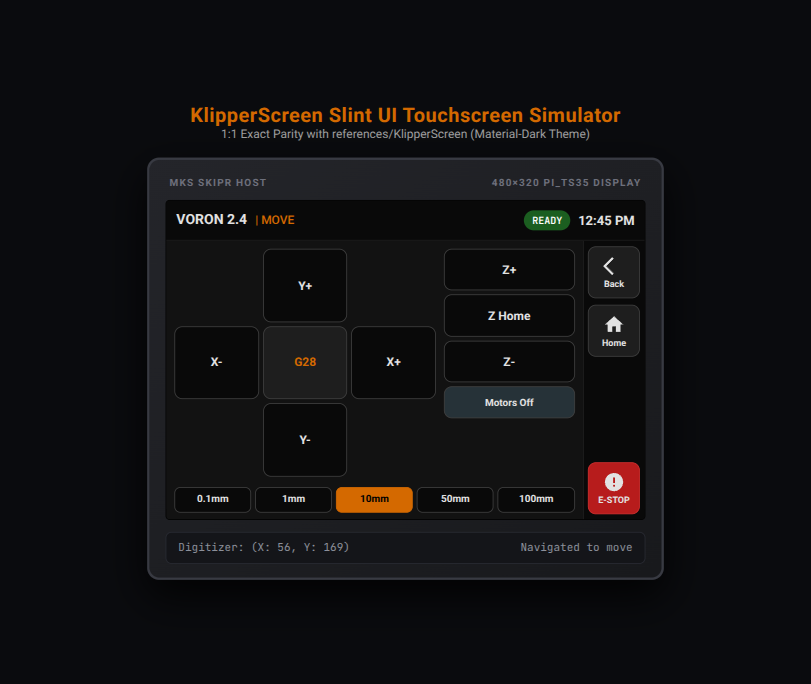

---

### 2. Thermal Control & Material Presets
Quick temperature target assignment for Extruder, Heated Bed, and Chamber with one-tap material presets (PLA $205^\circ / 60^\circ$, PETG $240^\circ / 80^\circ$, ABS $255^\circ / 105^\circ$, Cooldown $0^\circ / 0^\circ$).

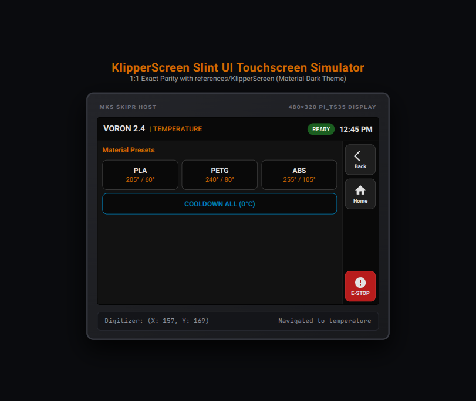

---

### 3. G-Code Storage & Print File Browser
Browsing local storage and virtual SD card files with file size metadata and instant print initiation.

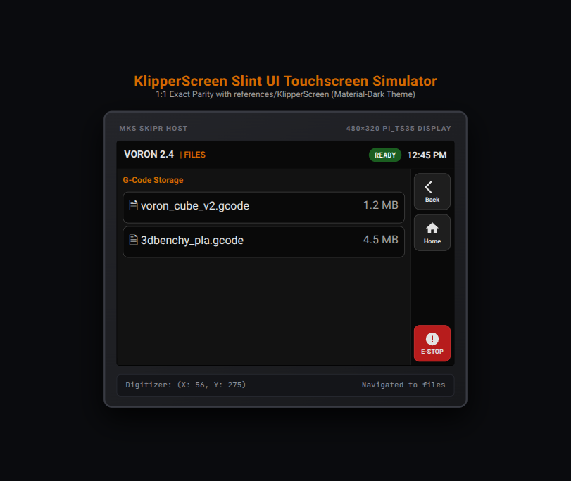

---

### 4. Active Print Job Status & Live Telemetry
Real-time visual print progress bar ($0-100\%$), current layer progression ($78/120$), remaining print duration estimation, speed/flow overrides, and Pause/Cancel buttons.

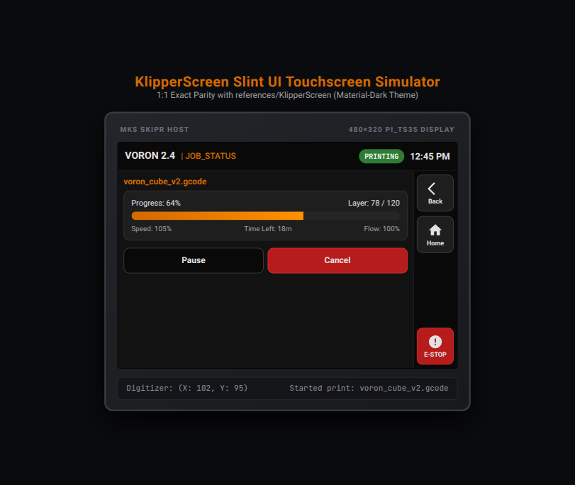

---

## 🎨 Complete Slint UI Component Gallery (Native `slint-viewer` Renders)

### 🖥️ Main Dashboard & System Navigation

| Main Menu (8-Tile Grid + Telemetry Pills) | App Window Top-Level Container |
| :---: | :---: |
| 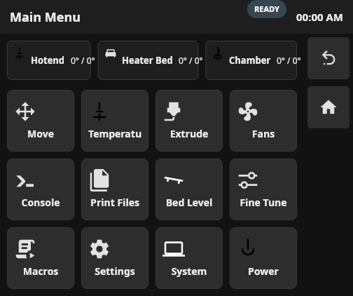 | 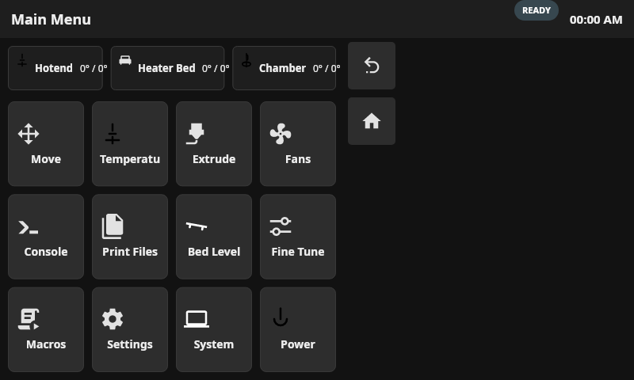 |

---

### 🎛️ Calibration & Advanced Tuning

| Bed Mesh 3D Probing Matrix | Z-Calibrate & Live Babystepping |
| :---: | :---: |
| 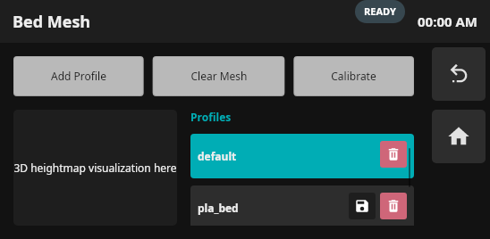 | 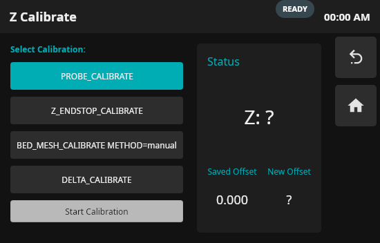 |

| Input Shaper Resonance Calibration (ADXL345) | Bed Level Screws (Screws Tilt Calculate) |
| :---: | :---: |
| 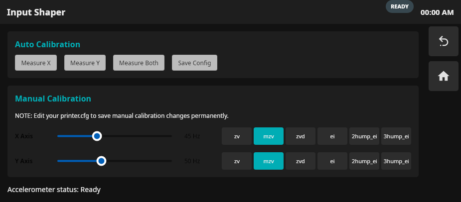 | 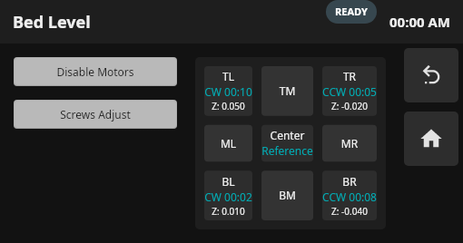 |

| Fine Tune (Babystep, Speed, Flow) | Pressure Advance & Retraction |
| :---: | :---: |
| 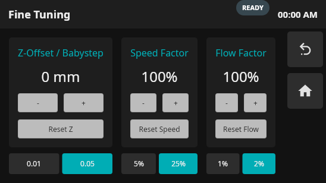 | 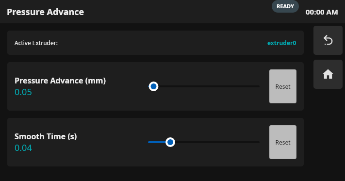 |

---

### ⚙️ Hardware Control & Extruder Management

| Extrude & Retract Length/Speed Controls | Cooling Fans & PWM Controllers |
| :---: | :---: |
| 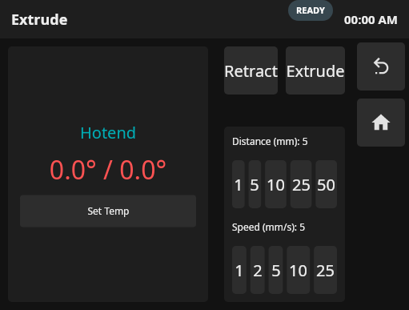 | 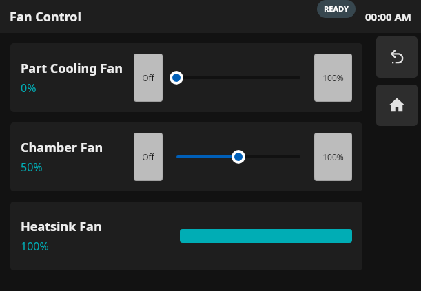 |

| Motion Limits (Velocity, Accel, Square Corner) | GPIO Pins & Output Switches |
| :---: | :---: |
| 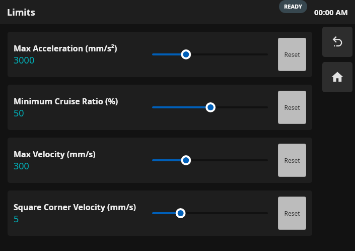 | 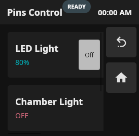 |

---

### 🧵 Filament Spoolman & Peripherals

| Spoolman Filament Manager | Spool Weight & Cost Editor |
| :---: | :---: |
| 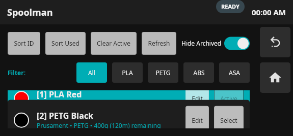 | 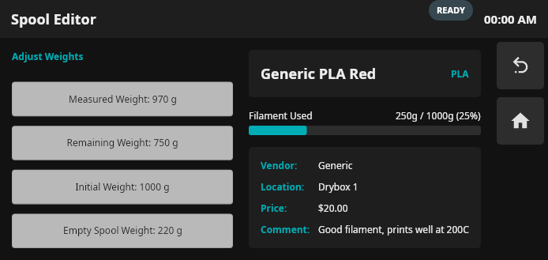 |

| LED Lighting & RGB Neopixel Controls | Live Camera Stream View |
| :---: | :---: |
| 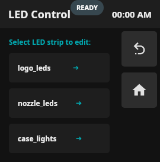 | 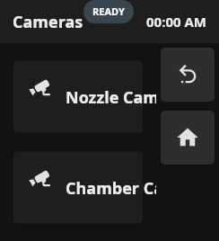 |

---

### 💻 System, Terminal & Power Controls

| Interactive G-Code Console Terminal | System Load & Hardware Stats |
| :---: | :---: |
| 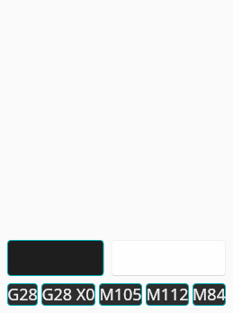 | 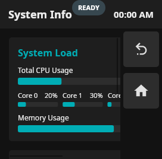 |

| Wi-Fi & Ethernet Network Manager | Power Relays & Smart Plugs |
| :---: | :---: |
| 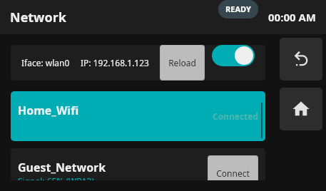 | 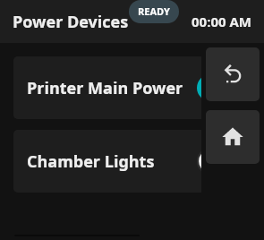 |

| Package & Firmware Updater | Host Shutdown & Service Restart |
| :---: | :---: |
| 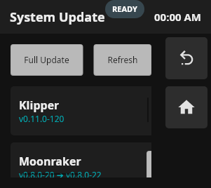 | 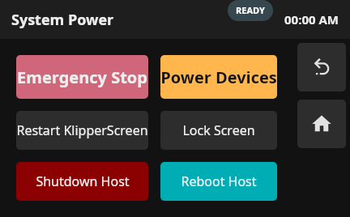 |

---

## 🧪 Automated Testing Commands

To reproduce the screenshots and verify the UI on your machine:

```bash
# 1. Test and render all 29 Slint components to PNG
python3 tools/scripts/test_with_slint_viewer.py

# 2. Run the full Rust integration test suite
cargo test -p host-ui

# 3. Serve the interactive touchscreen simulator
python3 tools/scripts/serve_simulator.py
```
